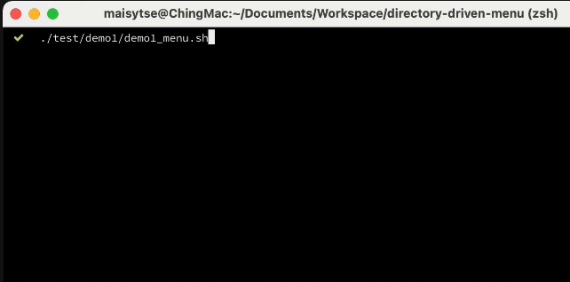

# Directory Driven Menu fro Shell Scripts

This is a simple helper script for creating a menu from a directory of scripts. 

Each item located in the given directory will be loaded as a item in the menu. A sub directory will become a sub menu.

## Demo
Refer to the `./test/demo1`.

File directory to create the menu:
```
config/
├── serviceA/
│  ├─ change-a-config.sh
├── serviceB/
│  ├─ change-b-config.sh
├── change-c-config.sh
```
Demo:


